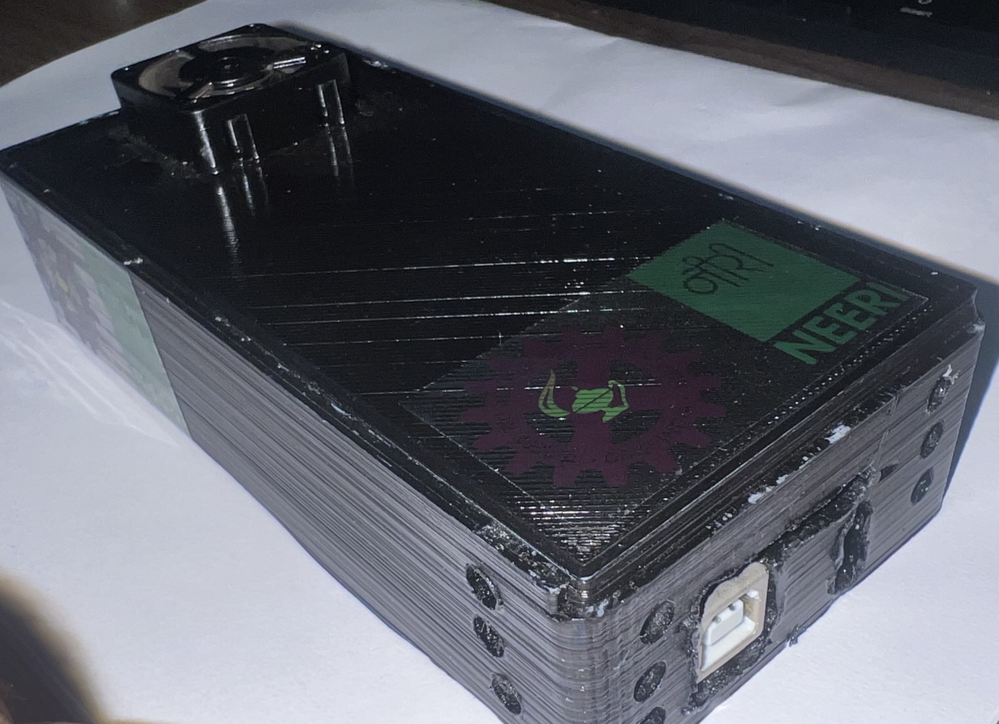

# Methane & CO₂ Data Logger (SD Card + RTC)

Embedded system for environmental gas monitoring with SD card data logging and RTC-based timestamping.

---

## Overview

This project implements a standalone embedded data logging system designed for monitoring methane, carbon dioxide (CO₂), temperature, and humidity in real-world environments. The system records time-stamped sensor data to an SD card in CSV format, making it suitable for long-term environmental and industrial monitoring applications.

The system is designed to operate independently without continuous network connectivity, enabling reliable field deployment.

---

## Key Features

* Methane sensing using analog gas sensor
* CO₂ sensing using MH-Z19 sensor (UART communication)
* Temperature & humidity sensing using AHT10 (I2C)
* Real-time timestamping using DS1307 RTC
* SD card data logging in CSV format
* Configurable logging interval
* Continuous and autonomous operation

---

## System Architecture


---

## System Flowchart


---

## Hardware Setup

Actual implementation of the data logging system:

<p align="center">
  
  
</p>

---

## Hardware Components

* Arduino (Uno/Nano)
* Methane Sensor (Analog output)
* MH-Z19 CO₂ Sensor
* AHT10 Temperature & Humidity Sensor
* DS1307 RTC Module
* SD Card Module

---

## Hardware Connections

* Methane Sensor → Analog Input (A0)
* MH-Z19 CO₂ Sensor → UART (SoftwareSerial)
* AHT10 → I2C (SDA, SCL)
* DS1307 RTC → I2C (SDA, SCL)
* SD Card Module → SPI (CS, MOSI, MISO, SCK)

---

## Software Overview

The system follows a structured data acquisition and logging process:

1. Initializes sensors (MH-Z19, AHT10) and communication interfaces
2. Initializes RTC for timestamping
3. Initializes SD card and creates a unique log file
4. Reads methane concentration via analog input
5. Retrieves CO₂ concentration from MH-Z19 sensor
6. Reads temperature, humidity, and dew point from AHT10
7. Fetches current timestamp from RTC
8. Formats data into CSV structure
9. Writes data to SD card
10. Flushes data periodically to ensure reliability

---

## Source Code

The implementation is available in the `/src` directory:

* `main.ino` – Core logic for sensor reading, timestamping, and data logging

---

## Sample Output

```
DateTime,Methane,CO2,Humidity,Temperature,DewPoint
2026-03-22 12:30:10,320,415,62.3,29.4,21.1
```

---

## Applications

* Environmental monitoring systems
* Landfill gas monitoring
* Industrial emission tracking
* Research data logging
* Field-deployable sensing systems

---

## System Capabilities

* Long-duration logging without network dependency
* Reliable timestamped data collection
* Multi-sensor integration in a single embedded platform
* Scalable for additional sensors or communication modules

---

## Future Improvements

* Wireless data transmission (LoRa / MQTT)
* Cloud-based data visualization
* Power optimization for battery-operated deployment
* Sensor calibration and data validation models

---

## License

This project is licensed under the MIT License.

---

## Note

This repository contains a simplified and non-confidential representation of work carried out during my time at CSIR–NEERI.
